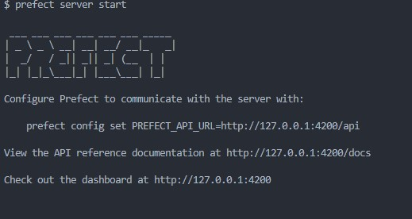

# Workflow orchestration
In this second phase of the project we will look at designing an ETL data pipeline and orchestrating the pipeline.

We are going to cover the following concepts:
    
    -Data lake and data warehouse
    -ETL and ELT
    -Workflow orchestration
    -Perfect concepts
    -Fetchinng data from web to google cloud storage using prefect
    -Getting data from google cloud storage to bigquery using prefect


 ## Data lake 
It is a centralized repository that allows one to store structured,unstructured and semi-structured data at any scale.

Data lake uses a flat architecture to store data,primarily in file or object strage.
Data lake are often used bt organizations to consolidate all their data in a central location as it is without the need to impose schema upfront.

One of the main challenge of a data lake is due to lack of some critical features like no support for transaction, poor performance optimization they eventually end up to be data swamps.


 ## Data warehouse
It is a data management system that is designed for data analytics.It requires that the data be organized in a schema.


 | Data lake | Data Warehouse
 | --- | ---|
 | Support all data types: Structured data, semi-structured data, unstructured (raw) data | Structured data only
 | Scales to hold any amount of data at low cost, regardless of type | Scaling up becomes exponentially more expensive due to vendor costs.
 | Written at the time of analysis (schema-on-read) | Designed prior to the DW implementation (schema-on-write)
 | Query results getting faster using low-cost storage | Fastest query results using higher cost storage.
 | Mostly used by Data scientists, Data developers, and Business analysts (using curated data) | Used by Business analysts.
 

## ETL and ELT data pipelines
ETL (Extract, Transform, Load) and ELT (Extract, Load, Transform) are data integration methods. Their main task is to transfer data from one place to another.

**ETL** extracts raw data from sources, transforms the data on a secondary processing server, and then loads the data into a target database.It is used when data must be transformed to conform to the data regime of a target database. 

**ELT** loads raw data directly into a target data warehouse, instead of moving it to a processing server for transformation.
With ELT data pipeline, data cleansing, enrichment, and data transformation all occur inside the data warehouse itself. Raw data is stored indefinitely in the data warehouse, allowing for multiple transformations.


## What is workflow orchestration
This is an end to end management of system and data process. Workflow orchestration help:
1. simplifyworkflow designs by monitoring and coordinating processes to ensure smooth execution.
2. Automate processes.Workflow orchestration engines enable automation of processes by defining and managing flow of tasks, data and events.
3. Improves process performance THe tools provide real time visibility into the status and progess of workflows.

THere are numerous orchestration tools used by developers but in this project we will work with **Prefect**

## Introduction to prefect
This is a workflow orchestration tool used to build,observe and react to data pipelines.With Prefect, you define workflows as Python code and let it handle the rest.

### Setup and execution
We will learn about various prefect concepts as we build the pipeline.

**Step** 1. Open the terminal of your choice and navigate to the project folder then Create a virtual environment.(In my case am usng gitbash)
```
python -m venv de-test
```
Activate the environment
```
source de-test/Scripts/activate
```
Those using cmd and powershell 
```
# In cmd.exe
de-test\Scripts\activate.bat

# In PowerShell
de-test\Scripts\Activate.ps1
```
Create a requirement.txt file and paste these libraries.Install the requirements.
```
pip install -r requirements.txt
```
Check the installation is successful by running this command
```
prefect version
```
 > :warning: if you get this error: from pydantic import basemodel, field, secretfield importerror: cannot import name 'secretfield' from 'pydantic' (c:\python311\lib\site-packages\pydantic\__init__.py).
 
 *****Use the latest version of prefect i.e 
prefect==2.12.1*****

**Step 2**: Create a prefect flow with tasks.
#### What is a flow 
Flows are like functions. They can take inputs, perform work, and return an output. In fact, you can turn any function into a Prefect flow by adding the ****@flow**** decorator. 

We created a data flow named data-ingest-flow

##### Parameters
As with any Python function, you can pass arguments to a flow. The positional and keyword arguments defined on your flow function are called parameters. Prefect will automatically perform type conversion using any provided type hints. We added table as our paremater and defined it data type **table_name: str** then passed it when callling the main function.

Check out the documentation for further details :point_right: [prefect documentation (flow)](https://docs.prefect.io/latest/tutorial/flows/)

```py
@flow(name="data-ingest-flow")
def main(table_name: str):
    url="https://github.com/DataTalksClub/nyc-tlc-data/releases/download/yellow/yellow_tripdata_2021-01.csv.gz"
    log_subflow(table_name)
    
    raw_data=extract_data(url)
    data=data_transform(raw_data)
    load_data(table_name,data)

if __name__ == '__main__':
    main("yellow_taxi_data")
```

#### Task
A task is a function that represents a discrete unit of work in a Prefect workflow.
They can take inputs, perform work, and return an output. A Prefect task can do almost anything a Python function can do.

You define task using **@task decorator**.
Task takes various arguments like:
- *name*:	an optional name for the task. If not provided, the name will be inferred from the function name
- *retries*:	an optional number of times to retry on task run failure.
- *cache_key_fn*:	an optional callable that, given the task run context and call parameters, generates a string key. If the key matches a previous completed state, that state result will be restored instead of running the task again.
- *cache_expiration*:	an optional amount of time indicating how long cached states for this task should be restorable; if not provided, cached states will never expire.

More details check out :point_right: [Prefect documentation (task)](https://docs.prefect.io/latest/tutorial/tasks/)

 Now we created 3 tasks 
 **Data_ingestion** task that downloads the data from a given url and it get stored as a dataframe 
 ```py
 @task(log_prints=True,retries=3,cache_key_fn=task_input_hash,cache_expiration=datetime.timedelta(days=1))
def extract_data(url):
    # Determine the output file name based on the URL
    if url.endswith('.csv.gz'):
        csv_name = 'output.csv.gz'
    else:
        csv_name = 'output.csv'
    os.system(f"wget {url} -O {csv_name}")
    df_iter = pd.read_csv(csv_name, iterator=True, chunksize=100000)
    df = next(df_iter)
    df.tpep_pickup_datetime = pd.to_datetime(df.tpep_pickup_datetime)
    df.tpep_dropoff_datetime = pd.to_datetime(df.tpep_dropoff_datetime)
    return df
 ``` 

 another task is **data_transformation task** that checks all 0 values in passenger_count (we assume that the taxi driver can't get paid for no passenger carried.) then remove all those rows.
 ```py
 @task(log_prints=True)
def data_transform(df):
        print(f"missing data in passenger count: {df['passenger_count'].isin([0]).sum()}")
        df=df[df['passenger_count'] !=0]
        print(f"missing data in passenger count: {df['passenger_count'].isin([0]).sum()}")
        return df
 ```

 The last task is **loading data** into our postgres database that we created using docker.In this task we used blocks
 #### Block 
 Blocks are a primitive within Prefect that enable the storage of configuration and provide an interface for interacting with external systems e.g databases,cloud services like AWS, GCP e.t.c

 We created an sqlAlchemy connector where we store the login credential to our database(postgres).
 First on the block endpoint in the prefect dashboard add SqlAlchamy connector and add the required configuration credentials.

 

Then other than passing the credentials in the function we use the connection block as shown below 

```py
@task(log_prints=True,retries=3)
def load_data(table_name,df):
    connection_block=SqlAlchemyConnector.load("postgres-connection")
    with connection_block.get_connection(begin=False) as engine:
        df.head(n=0).to_sql(name=table_name, con=engine, if_exists='replace')
        df.to_sql(name=table_name, con=engine, if_exists='append'
```


**Step 3:** Run this code after finishing modifying the script.
 ```
 python flows/prefect_ETL_script.py
 ```

 When it is successful you should get such an output 
 
 **Step 4**. fire up prefect UI locally by running the following command in the terminal.(prefect orion is a GUI dashboard that allows us to track and see and manage flows,runs, blocks and deployments.)
 ```
 run prefect server start
 ```
> :warning: The 'prefect orion' command group has been deprecated. It will not be available after Aug 2023. Use 'prefect server' instead.
 
 
 You should get the output below and then go to the directed link

 
 
 

## Fetching data from web to google cloud storage using flows


 


