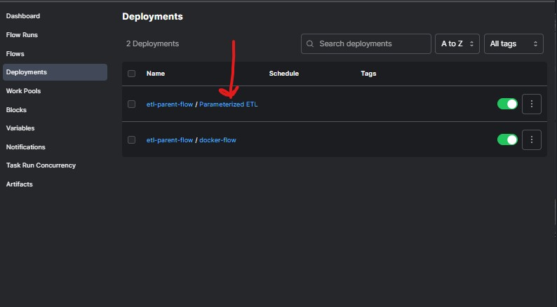
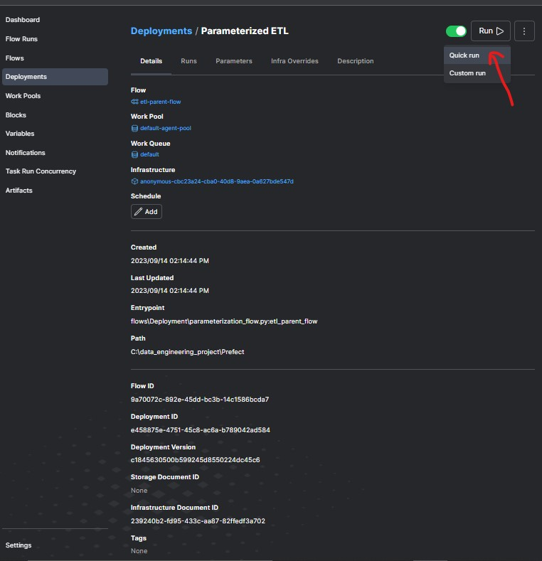
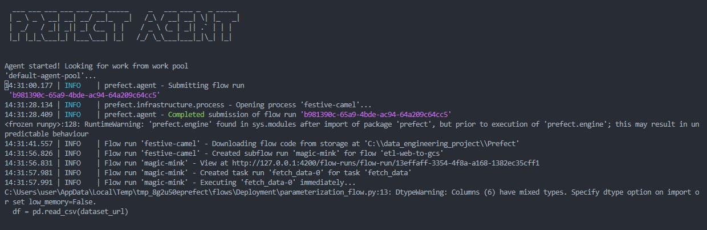
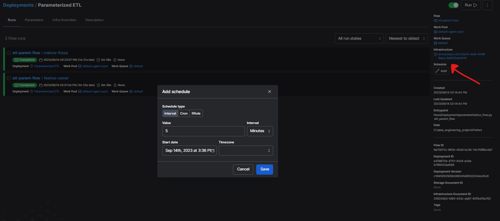

# Parameterization and deployment

[Reference video](https://www.youtube.com/watch?v=QrDxPjX10iw&list=PL3MmuxUbc_hJed7dXYoJw8DoCuVHhGEQb&index=23)

Now that we have created scripts that fetch data from web to gcs and from gcs to biquery, we will then look at how we can modify the script so that we add diffrent parameters rather than hard coding them and passing diffrent arguments during runtime.

## Parameters
Parameters enable us to pass data to a flow that can vary by use case without having to adjust the flow itself.

### Introduction
- Copy  `ETL_web_to_bigquey.py` script, create a new python script and name it `parameterization_flow.py` then paste the code there.
- Remove the hard coded color, year and monthe from the original flow.
- create a parent flow `etl_parent_flow` that take in the argumemts and will have three flow instances from one parent flowt.
  ```py
  @flow()
  def etl_web_to_gcs(year:int,month:int,color:str):
    
    dataset_file=f"{color}_tripdata_{year}-{month:02}"
    dataset_url = f"https://github.com/DataTalksClub/nyc-tlc-data/releases/download/{color}/{dataset_file}.csv.gz"

    df=fetch_data(dataset_url)
    clean_df=clean_data(df)
    path = write_local(clean_df, color, dataset_file)
    load_to_gcs(path)

    @flow()
    def etl_parent_flow(
        months: list[int] = [1, 2], year: int = 2021, color: str = "yellow"):
        for month in months:
            etl_web_to_gcs(year, month, color)
    if __name__=='__main__':
        color="yellow"
        months=[1,2,3]
        year= 2021
        etl_parent_flow(months,year,color)
    
  ```
    - run the script using the comand below.Get to google cloud storage and you should see 3 parquet file created.
  ```
  python/flow/deployment/parameterization_flow.py
  ```

## prefect deployment
Deployments are server-side representations of flows. They store the crucial metadata needed for remote orchestration including when, where, and how a workflow should run. Deployments elevate workflows from functions that you must call manually to API-managed entities that can be triggered remotely.

### Building the deployment from the CLI

Run the command below to create a YAML file

```
prefect deployment build flows/deployment/parameterization_flow.py:etl_parent_flow -n "Parameterized ETL"
```
- when building a deployment you give the name of the script `flows/deployment/parameterization_flow.py:` and **entry point** which is `etl_parent_flow` and then the name of the deployment.

- This creates a yaml file with all the details.WE can add the parameters to the yaml file i.e 

    ```parameters: {"colour":"yellow",months:[1,2,3],"year": 2021}```

Then we need to apply the deployment using this command
```
prefect deployment apply etl_parent_flow-deployment.yaml
```


### run and work agents
- From the created deployment we can have a quick run.A run is a  instance of the flow


- When we run the deployment is in scheduled mode waiting for an agent 

**work agent** is a light weight python process that living in the execution environment (in our case now it is locally).

Start the agent using the command below
```
prefect agent start --pool "default-agent-pool" --work-queue "default"
```



## Schedules and Docker storage with infrastructure

[Reference video](https://www.youtube.com/watch?v=psNSzqTsi-s&list=PL3MmuxUbc_hJed7dXYoJw8DoCuVHhGEQb&index=24)

Let look at scheduling our flows and running running the flows in Docker container.

#### Scheduling
- in the prefect UI go to the deployed flow and click on add schedule.We are going to schedule our flow to run at every 5 minutes using **interval** chedule type



#### Running flows in docker container
- we need to create a **Dockerfile** that contains the flow script, pip packages requirements and data

```docker
FROM prefecthq/prefect:2.12.1-python3.11

COPY docker-requirements.txt .

RUN pip install -r docker-requirements.txt --trusted-host pypi.python.org --no-cache-dir

RUN mkdir -p /opt/prefect/data/
RUN mkdir -p /opt/prefect/data/yellow
RUN mkdir -p /opt/prefect/flows/

COPY flows /opt/prefect/flows


```
- The **FROM** line specifies an image and Python version.
- There is a **COPY** command to copy the docker-requirements.txt file into the current directory of the Docker container.Make sure you have created a docker-requiremnts.txt with the following packages to install
 ```
pandas==1.5.2
prefect-gcp[cloud_storage]==0.2.4
protobuf
pyarrow==10.0.1
pandas-gbq==0.18.1
pathlib2
```
- There is a command to **RUN pip** to install the packages listed in docker-requirements.txt.
- RUN mkdir -p command is used to create a directory structure needed for the script or ensure that certain directories are present when you we build the image.
- There is a command to **COPY our flows** directory into /opt/prefect/flows while COPY data /opt/prefect/data copies that data just incase it is needed.
Finally, there is a command to run the mkdir command to create


To build the docker image, run:

``` 
docker image build -t gatobu/prefect:prefect-flow . 
```
> [!note]: If you are not logged in to Docker Hub on your local machine or VM, log in with docker login.  
gatobu is my Docker Hub username


To push the image to the hub run this command
```
docker image push gatobu/prefect:prefect-flow
```
#### Creating a docker container block
We can create a docker block using 2 ways:
1. From the prefect UI
      - Navigate to the block section and add docker container.Give the name and the image that we created `gatobu/prefect:prefect-flow`
> Note: if you don't specify the specific image we build then it will use the base prefect which will not contain our flows
2. Using a python code 
   ```py
   from prefect.infrastructure.container import DockerContainer

    docker_block = DockerContainer(
        image="gatobu/prefect:prefect-flow",  # insert your image here
        image_pull_policy="ALWAYS",
        )
    docker_block.save("prefect-etl-deploy", overwrite=True)
   ```

Remember earlier on we deployed from the command line now we are going to deploy using a python file.
- create a docker_deploy.py file and paste the following code 
 ```py
    from prefect.infrastructure.container import DockerContainer
    from prefect.deployments import Deployment
    from parameterization_flow import etl_parent_flow

    docker_container_block = DockerContainer.load("prefect-etl-deploy")# replace with your docker block name
    docker_dep = Deployment.build_from_flow(
    flow=etl_parent_flow,
    name="docker-flow",
    infrastructure=docker_container_block,
    )

    if __name__ == "__main__":
    docker_dep.apply()
```
Run the script `python flows/Deployment/docker_deploy.py`

### Prefect Profiles (Docker Container - Orion Server Integration)
Run the following command to check which profile you are using
```
prefect profile ls
```
We need to specify that we want to use an API endpoint at a specific URL
Run this:

```
prefect config set PREFECT_API_URL="http://127.0.0.1:4200/api"
```

Fire up the agent that will look for work in the work work queue
```
prefect agent start -q default
```
Now that we have an agent and a deployed flow, we can run the deployment from the Orion UI or with this CLI command: 
```
prefect deployment run etl-parent-flow/docker-flow -p "months=[1,2]"
```