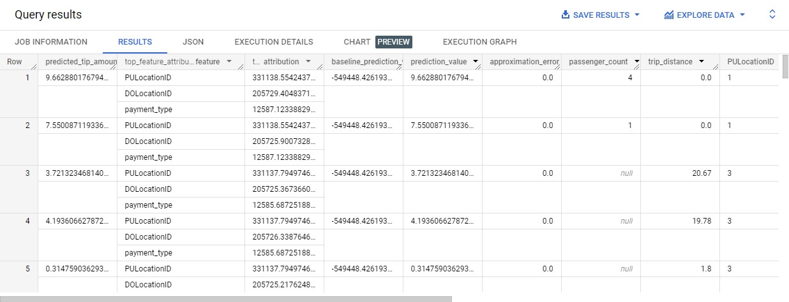

# BIGQUERY DATA WAREHOUSE
    - Introduction to bigQuery
    - partitioning
    - Clustering
    - BigQuery bet practices
    - Machine learning in bigQuery


## Introduction to BigQuery

[Biqquery video](https://www.youtube.com/watch?v=jrHljAoD6nM&list=PL3MmuxUbc_hJed7dXYoJw8DoCuVHhGEQb&index=25)

Google BigQuery is a serverless, highly scalable data warehouse that comes with a built-in query engine.

Built-in features like 
  - machine learning
  - geospatial analysis
  - business intelligence

BigQuery maximizes flexibility by separating the compute engine that analyzes your data from your storage

So lets create a table that gets its data from google cloud storage
```sql
CREATE OR REPLACE EXTERNAL TABLE `data-engineering-398114.trips_data_all.rides`
OPTIONS (
  format = 'parquet',
  uris = ['gs://de_data_lake_data-engineering-398114/data/yellow/yellow_tripdata_2021-02.parquet','gs://de_data_lake_data-engineering-398114/data/yellow/yellow_tripdata_2021-01.parquet']
)
```
`CREATE OR PLACE EXTERNAL TABLE` statement allows us to create a new table by defining `PROJECT-ID` then the `dataset name` and now the  `table name` that will be created.

Option parameter taken in the data format and the url to bucket in the cloud storage


## Partitioning
A partitioned table is divided into segments, called partitions, that make it easier to manage and query your data. By dividing a large table into smaller partitions, you can improve query performance and control costs by reducing the number of bytes read by a query. You partition tables by specifying a partition column which is used to segment the table.


Ways to partition a table:
1. Specific **INTEGER** column.E.g customer_id.
2. Time-unit column partitioning.THis includes **DATE**,**TIMESTAMP** or **DATETIME** columns.
3. Ingestion time partitioning:BigQuery automatically assigns rows to partitions based on the time when BigQuery ingests the data. You can choose hourly, daily, monthly, or yearly granularity for the partitions.


Consider partitioning a table in the following scenarios:

  - You want to improve the query performance by only scanning a portion of a table.
  - Your table operation exceeds a standard table quota and you can scope the table operations to specific partition column values allowing higher partitioned table quotas.
  - You want to determine query costs before a query runs. BigQuery provides query cost estimates before the query is run on a partitioned table. Calculate a query cost estimate by pruning a partitioned table, then issuing a query dry run to estimate query costs.

lets create a non partioned table and a partioned table and see how the query performance compares
```sql
-- Create a non partitioned table from external table
CREATE OR REPLACE TABLE data-engineering-398114.trips_data_all.rides_non_partitoned AS
SELECT * FROM data-engineering-398114.trips_data_all.rides;

-- Create a partitioned table from external table
CREATE OR REPLACE TABLE data-engineering-398114.trips_data_all.rides_partitoned
PARTITION BY
  DATE(tpep_pickup_datetime) AS
SELECT * FROM data-engineering-398114.trips_data_all.rides;

```
- when creating a partitioned table you have to define which column is the bases of the partition.In this code we have used pickup datetime as the `PARTITION BY
  DATE(tpep_pickup_datetime)`.

Performance analysis
```sql
-- Impact of partition
-- Scanning 40.33 MB of data 
SELECT DISTINCT(VendorID)
FROM data-engineering-398114.trips_data_all.rides_non_partitoned
WHERE DATE(tpep_pickup_datetime) BETWEEN '2021-02-01' AND '2021-02-27';

-- Scanning ~19.62 MB of DATA
SELECT DISTINCT(VendorID)
FROM data-engineering-398114.trips_data_all.rides_partitoned
WHERE DATE(tpep_pickup_datetime) BETWEEN '2021-02-01' AND '2021-02-27';
```
- for the partioned data we can see it scans just 19.62MB of data compared to un partioned table that scans 40.33MB.

>[NOTE] Data less than 1GB does not depict the fully impact of query perfomance for partitioned and non partitioned tables. 

## Clustering
[video](https://www.youtube.com/watch?v=-CqXf7vhhDs&list=PL3MmuxUbc_hJed7dXYoJw8DoCuVHhGEQb&index=26)

Clustered tables in BigQuery are tables that have a user-defined column sort order using clustered columns. Clustered tables can improve query performance and reduce query costs.
Example:


When you cluster a table using multiple columns, the column order determines which columns take precedence when BigQuery sorts and groups the data into storage blocks.

## clustering and partitioning
You can combine table clustering with table partitioning to achieve finely-grained sorting for further query optimization.
```sql
-- Creating a partition and cluster table
CREATE OR REPLACE TABLE data-engineering-398114.trips_data_all.rides_partitoned_clustered
PARTITION BY DATE(tpep_pickup_datetime)
CLUSTER BY VendorID AS
SELECT * FROM data-engineering-398114.trips_data_all.rides;
```
- Here the table is partitioned on `tpep_pickup_datetime` column and then clustered on `VendorID`

### Clustering over partitioning
1. When partitioning results in a small amount of data per partition (<1GB).
2. When partitioning results in a large number of partitions beyond  the limits on partitioned table.
3. When partitioning results in your mutation operation modifying the majority of partitions in the table frequency.


##  MACHINE LEARNING IN BIGQUERY
-   [Video](https://www.youtube.com/watch?v=B-WtpB0PuG4)
  
BigQuery ML lets you create and run machine learning (ML) models by using GoogleSQL queries.

In this section we will look at 

    - How to create a model.
    - Model evaluation and prediction.
    - Hyperparameter tuning.

## Creating a model
A model in BigQuery ML represents what an ML system has learned from training data. The choice of model to use depends on the problem you are trying to solve.
The diagram below shows types of model and their use cases.


We want to create a model that will predict the fare_amount based on some variables.

- let create another table we can name it `riders_ml` getting only required columns and changing the data types of some columns
  ```sql
  CREATE OR REPLACE TABLE `data-engineering-398114.trips_data_all.rides_ml` (
   `passenger_count` INTEGER,
    `trip_distance` FLOAT64,
    `PULocationID` STRING,
    `DOLocationID` STRING,
    `payment_type` STRING,
    `fare_amount` FLOAT64,
    `tolls_amount` FLOAT64,
    `tip_amount` FLOAT64) AS 
    (SELECT cast(passenger_count AS INTEGER), trip_distance, cast   (PULocationID AS STRING), CAST(DOLocationID AS STRING),
        CAST(payment_type AS STRING), fare_amount, tolls_amount, tip_amount
    FROM `data-engineering-398114.trips_data_all.rides_partitoned` 
    WHERE fare_amount != 0
     );
  ```
- lets now create a linear regression model.We use `CREATE MODEL` statement to create and train model.`OPTIONS(model_type='logistic_reg')` clause allows us to define the model we are going to use.
`input_label_cols=['tip_amount']` specifies the target variable to be predicted.
`DATA_SPLIT_METHOD='AUTO_SPLIT'` splits the data into training and test 
Here is the complete code:
```sql
CREATE OR REPLACE MODEL `data-engineering-398114.trips_data_all.tip_amount_model`
OPTIONS
  (model_type='linear_reg',
  input_label_cols=['tip_amount'],
  DATA_SPLIT_METHOD='AUTO_SPLIT') AS
SELECT *
FROM `data-engineering-398114.trips_data_all.rides_ml`
WHERE tip_amount IS NOT NULL;
```
## Model evaluation
ML model evaluation metrics for the following purposes:

- To assess the quality of the fit between the model and the data.
- To compare different models.
- To predict how accurately you can expect each model to perform on a specific dataset, in the context of model selection.

` ML.EVALUATE` function evaluate the predicted values against the actual data.

```sql
SELECT *
FROM ML.EVALUATE(MODEL `data-engineering-398114.trips_data_all.tip_amount_model`,
    (SELECT * 
    FROM `data-engineering-398114.trips_data_all.rides_ml` 
     WHERE tip_amount IS NOT NULL));

```
When you run the query you should get an output showing results of various evaluation metrics


## prediction
Prediction in BigQuery ML is used not only for supervised learning models, but also unsupervised learning models. It is used only for models trained with independent and identically distributed (IID) data.

The `ML.PREDICT` function is used to predict a numerical value for the tip_amount using your model: **data-engineering-398114.trips_data_all.tip_amount_model**
```sql
SELECT *
FROM
  ML.PREDICT(MODEL `data-engineering-398114.trips_data_all.tip_amount_model`,
    (SELECT *
    FROM `data-engineering-398114.trips_data_all.rides_ml`
    WHERE tip_amount IS NOT NULL));
```
The output looks like this 


The `ML.EXPLAIN_PREDICT` function generates a predicted value and a set of feature attributions per instance of the input data. 
Feature attributions indicate how much each feature in your model contributed to the final prediction for each given instance.

`top_k_features` specifies how many top feature attribution pairs are generated per row of input data. The features are ranked by the absolute values of their attributions.
```sql
SELECT *
FROM
ML.EXPLAIN_PREDICT(MODEL `data-engineering-398114.trips_data_all.tip_amount_model`,
   (SELECT *
    FROM `data-engineering-398114.trips_data_all.rides_ml`
    WHERE tip_amount IS NOT NULL), 
STRUCT(3 as top_k_features));
```
The output:


From the output we can see for each predicted instance we are able to see the top 3 contributing variables.

## Hyperparameter tuning
Hyperparameter tuning identifies a set of optimal hyperparameters for a learning algorithm.

A hyperparameter is a model argument whose value is set before the learning process begins.

To tune a hyperparameter, you must specify a range of values for that hyperparameter that the model can use for a set of trials. You can do this by using one of the following keywords when setting the hyperparameter in the `CREATE MODEL` statement, instead of providing a single value.

We will use `l1_reg` that specifies amount of L1 regularization applied and `l2_reg` that specifies amount of L2 regularization applied.
`num_trials=5` describes the number of submodels to use.
`max_parallel_trials=2` decribes the maximum number of trials to run at the same time.

```SQL
CREATE OR REPLACE MODEL `data-engineering-398114.trips_data_all.tip_amount_hypertuned_model`
OPTIONS
(model_type='linear_reg',
input_label_cols=['tip_amount'],
DATA_SPLIT_METHOD='AUTO_SPLIT',
num_trials=5,
max_parallel_trials=2,
l1_reg=hparam_range(0, 20),
l2_reg=hparam_candidates([0, 0.1, 1, 10])) AS
SELECT *
FROM `data-engineering-398114.trips_data_all.rides_ml`
WHERE tip_amount IS NOT NULL;

```


Reference materials

- [Bigquery ML Introduction](https://cloud.google.com/bigquery/docs/bqml-introduction)
- [BigQuery ML tutorial](https://cloud.google.com/bigquery/docs/linear-regression-tutorial)
- [Model creation overview](https://cloud.google.com/bigquery/docs/model-overview)
- [Model evaluation onerview](ps://cloud.google.com/bigquery/docs/evaluate-overview)
- [Model Hyperparameter tuning overview](https://cloud.google.com/bigquery/docs/hp-tuning-overview)