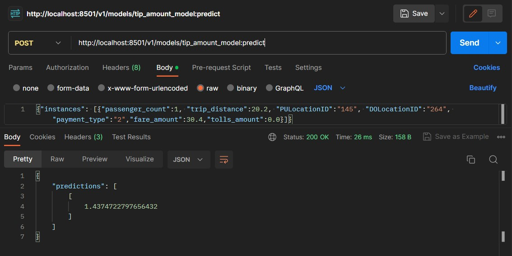

# Exporting ML model and deployment
[Video tutorial](https://www.youtube.com/watch?v=BjARzEWaznU&list=PL3MmuxUbc_hJed7dXYoJw8DoCuVHhGEQb&index=30)

In this section we are going to look at how to export the model we created into google cloud storage and the deploy it in docker.

## Steps

- Access cloud platform with google user credentials(open terminal of your choice, make sure google cloud CLI is intsalled)
```
gcloud auth login
```
>Make sure you are logged into the account the want to work with.

- Export the model to google cloud storage
```
bq --project_id data-engineering-398114 extract -m trips_data_all.tip_amount_model  gs://de_data_lake_data-engineering-398114/tip_amount_model
```
- create a directory named model
 ```
 for CMD and powershell
    mkdir \tmp\model

linux including git bash,mac
   mkdir /tmp/model
```

- Copy the trip_amount_model from the cloud into our local directory named model
```
gsutil cp -r gs://de_data_lake_data-engineering-398114/tip_amount_model \tmp\model
```
- create a serving directory tip_amount_model version 1
```
    mkdir -p serving_dir/tip_amount_model/1
```

- Copy the content in tip_amount_model temporary directory we created to a serving directory which is in our working directory

```
cp -r /c/tmp/model/tip_amount_model/* /c/data_engineering_project/BigQuery/serving_dir/tip_amount_model/1
```
- Lets pull tensorflow image
```
docker pull tensorflow/serving
```
- Run docker container
``` 
docker run -p 8501:8501 --mount type=bind,source=$(pwd)/serving_dir/tip_amount_model,target=/models/tip_amount_model -e MODEL_NAME=tip_amount_model -t tensorflow/serving
```
- Run `docker ps` command to check if your container is running

- Using post man we can also do a GET request to ensure that we can access the data
`http://localhost:8501/v1/models/tip_amount_model`


Make a POST request to get the predicted tip amount by passing in some varlues for our variable

POST `http://localhost:8501/v1/models/tip_amount_model:predict`

- on postman >body >raw >text(json) paste the following instance to be predicted

```json
{"instances": [{"passenger_count":1, "trip_distance":20.2, "PULocationID":"145", "DOLocationID":"264", "payment_type":"2","fare_amount":30.4,"tolls_amount":0.0}]} 
```
You should get predicted tip_amount as shown below

