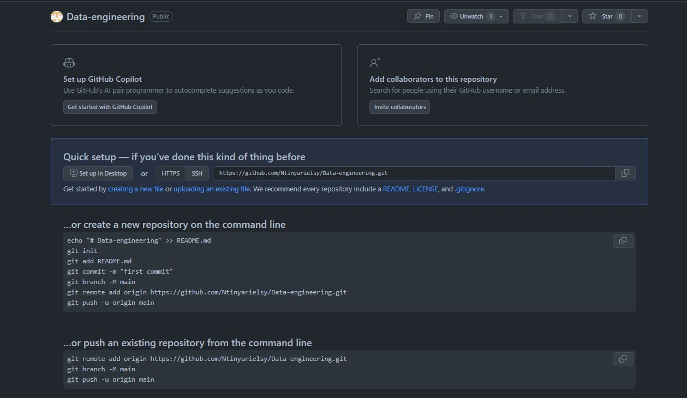
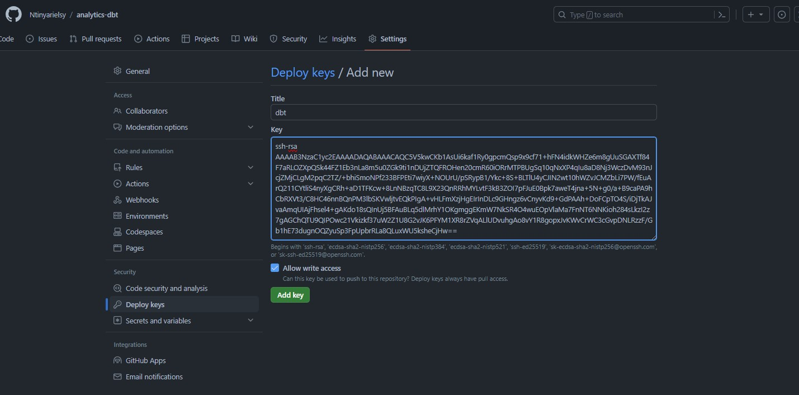
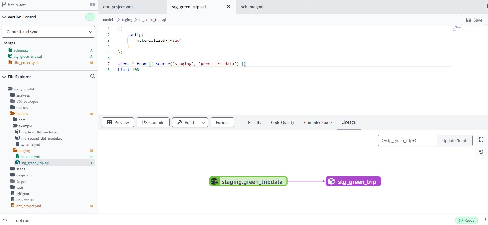
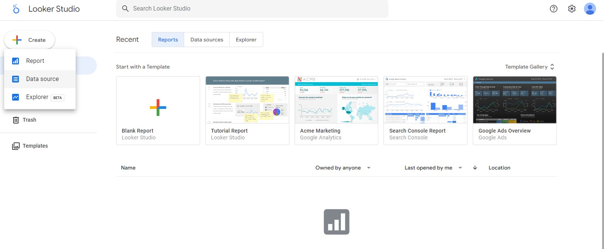

# DATA MODELING USING DBT

In this section we are looking at the role of analytics engineer who bridges the gap between a data engineer and data scientist and or data analysts.Data modeling as one of their roles involving transormation and tailoring the data in a data platform to the required format for the downstream persons to use.

Here is a process flow we will use


## OUTLINE
- [DATA MODELING USING DBT](#data-modeling-using-dbt)
  - [OUTLINE](#outline)
  - [Prerequisites](#prerequisites)
  - [Dbt (Data build tool) overview](#dbt-data-build-tool-overview)
    - [why dbt?](#why-dbt)
  - [dbt cloud](#dbt-cloud)
    - [dbt cloud setup:](#dbt-cloud-setup)
  - [Developing dbt models](#developing-dbt-models)
      - [Discussion :memo:](#discussion-memo)
      - [materialization stategies](#materialization-stategies)
    - [from clause in dbt](#from-clause-in-dbt)
      - [Source](#source)
    - [defining macros](#defining-macros)
    - [packages](#packages)
    - [Variables](#variables)
  - [dbt seeds](#dbt-seeds)
  - [dbt core models](#dbt-core-models)
  - [TESTING AND DEPLOYMENT](#testing-and-deployment)
  - [Testing](#testing)
  - [Documentations](#documentations)
  - [DEPLOYMENT](#deployment)
  - [Continous integration (CI)](#continous-integration-ci)
  - [Dbt jobs](#dbt-jobs)
  - [Data visualization using Looker studio](#data-visualization-using-looker-studio)


## Prerequisites
There are 4 datasets we are going to use [data](https://github.com/DataTalksClub/nyc-tlc-data/):
- Yellow taxi data -years 2019 and 2020
- Green taxi data -uears 2019 and 2020
- fhv data- year 2019
- Taxi_zone lookup -a csv file you can access it here [tax_zone_lookup.csv](https://d37ci6vzurychx.cloudfront.net/misc/taxi+_zone_lookup.csv)

:hand: *_ If you don't have the data in your google storage already use this script [web_to_gcs.py](web_to_gcs.py)*

Go through the fundamentals of dbt cloud:point_right:[here](https://courses.getdbt.com/courses/fundamentals) from dbt course to get acquinted with the terms and know how of creating models,testng and deploying.

## Dbt (Data build tool) overview
dbt is a transformation workflow that helps you get more work done while producing higher quality results.

It is development framework that combines modular SQL with software engineering best practices like testing,modularity,version control, CI/CD to make data transformation reliable, fast, and fun.

### why dbt?
- Build up reusable, or modular, data models that can be referenced in subsequent work instead of starting at the raw data with every analysis.
- Avoid writing boilerplate DML and DDL by managing transactions, dropping tables, and managing schema changes.
- Performs automated testing.
- Maintain data documentation and definitions within dbt as they build and develop lineage graphs

You can access dbt in 2 ways
1. dbt cloud-web-based UI
2. dbt core-CLI tool that can be run locally.

## dbt cloud
dbt Cloud is the fastest and most reliable way to deploy dbt. Develop, test, schedule, and investigate data models all in one web-based UI.

For this project we will entirely work with dbt cloud.

### dbt cloud setup:
Before creating a project in debt we need to have created a service account and generated json key in google cloud platform.Watch the video below to get guidance on setting up the account
:cinema:[Setting up service account](https://www.youtube.com/watch?v=qXuw--126Bk).

| :memo:        | Take note of this       |
|---------------|:------------------------|

when choosing the the roles add the following:
- storage Admin
- Storage object Admin
- Bigquery Admin

Dowload the json key (we will use it later in the project)

Now register on dbt cloud with the free option.
- choose connection: BigQuery
    
  
- Under settings click on upload a service account json flile and upload the json key.
    

<u>Development Credentials</u>

- Create a dataset in bigquery and then the name of the created dataset paste it under Development credentials/dataset.
   

- Test connection 
  
<u>Set up a repository</u>
- Create an empty rep in your Github and copy the ssh key.
      

- Click on Git clone and Paste the ssh key
  
    
This will create a deploy key that you should add to your repo.Navigate to your github to you>settings>deploykeys>Add deploy keys and paste the generated key here.

  

:clap: Huraay!!  you are done and you should get the following output


To start development click on start development in the IDE and initialize git, this will create the basic project structure (models, macros,yaml files) from where we can modify.


:warning:
You cannot make changes directly in the main branch as it is only read only mode and therefore crrate a new branch, make changes and later you will merge.


## Developing dbt models
:cinema: [Video](https://www.youtube.com/watch?v=UVI30Vxzd6c&list=PL3MmuxUbc_hJed7dXYoJw8DoCuVHhGEQb&index=35)

**dbt models** are basically sql files with select statements.

create two new folders in the model folder
1. staging: where we will create our raw data and do things like casting etc
2. core: create our models that we will use in our reporting and bi tools.

Let create our first model
- create a `stg_green_trip.sql` file in models/staging folder.
- paste the following code:
```sql
{{
    config(
        materialized='view'
    )
}}

where * from {{ source('staging', 'green_tripdata') }}
Limit 100
```

#### Discussion :memo:


`{{  
    config(materialized='table')  
}}`-this code is written in jinja.

**Jinja** is a templating language for python.
It allows us to do things that aren't normally possible in SQL e.g use control structures(loops and if statements) use environment variable.

You can recognize Jinja based on the delimiters the language uses, which we refer to as "curlies":

- **Expressions {{ ... }}:** Expressions are used when you want to output a string. You can use expressions to reference variables and call macros.

- **Statements :** Statements are used for control flow, for example, to set up for loops and if statements, or to define macros.


- **Comments {# ... #}:** Jinja comments are used to prevent the text within the comment from compiling.

`config(materialized='table')`
config is a function known as macro that we define the parameters we want to use.

**Macros** are basically pieces of code that can be used multiple lines.They are analogus to functions in any programming language.

#### materialization stategies
1. **View:** our model is rebuilt as a view on each run.A view we can say it is a 'stored query'.They do not store data rather tehy derive data from another table on which they are based.

2. **Table :** our model is rebuilt as a table on each run.

3. **Incremental:** allow dbt to insert or update records into a table since the last time that model was run.

4. **Ephemeral:** models are not directly built into the database. Instead, dbt will interpolate the code from this model into dependent models as a common table expression.

Read more:point_right:[here](https://docs.getdbt.com/docs/build/materializations)

### from clause in dbt
From clause is used to define the data sources.

From clause can be used with diffrennt macros to such as `source()` ,`seed()`,`ref()` to reference where the data is stored.

#### Source
- The data loaded to our data warehouse that we use as sources for our models.
- We define a .yml file that contains details of the daatabase and the tables containing data.In our case

Create a .yml file in the staging folder you can name it **schema.yml**. In the file define the version,source name,database,schema and the tables where your data is contained,
``` yml
sources:
    - name: staging
      database: data-engineering-398114  # For bigquery project ID
      schema: ny_taxi_data # dataset where the table containing data.

      tables:
        - name: green_tripdata
        - name: yellow_tripdata
```

Also in source
- Used with the source macro that will resolve the name to the right schema, plus build the dependencies automatically 
- Source freshness can be defined and tested

At the end you should have the following


on the CLI run the following command to build the models

```
dbt run
```
`dbt run` command creates executes all the models in the model folder even the example models, however if you want to execute a specify model the use this command

```
dbt run --select stg_green_trip
```
When it successful you should get this output


Let's modify the code and chenge the data types of some columns

```sql
{{
    config(
        materialized='view'
    )
}}

select 
 -- identifiers
    cast(vendorid as integer) as vendorid,
    cast(ratecodeid as integer) as ratecodeid,
    cast(pulocationid as integer) as  pickup_locationid,
    cast(dolocationid as integer) as dropoff_locationid,

    -- timestamps
    cast(lpep_pickup_datetime as timestamp) as pickup_datetime,
    cast(lpep_dropoff_datetime as timestamp) as dropoff_datetime,

    -- trip info
    store_and_fwd_flag,
    cast(passenger_count as integer) as passenger_count,
    cast(trip_distance as numeric) as trip_distance,
    cast(trip_type as integer) as trip_type,

    -- payment info
    cast(fare_amount as numeric) as fare_amount,
    cast(extra as numeric) as extra,
    cast(mta_tax as numeric) as mta_tax,
    cast(tip_amount as numeric) as tip_amount,
    cast(tolls_amount as numeric) as tolls_amount,
    cast(ehail_fee as numeric) as ehail_fee,
    cast(improvement_surcharge as numeric) as improvement_surcharge,
    cast(total_amount as numeric) as total_amount,
    cast(payment_type as integer) as payment_type,
    cast(congestion_surcharge as numeric) as congestion_surcharge

from {{ source('staging', 'green_tripdata') }}
Limit 100
```

### defining macros
We said earlier that macros are just like functions in programming languages.In programming langueges functions returns a given result nut in macros they return a code.

They are also definedin .sql files


create a new file under macros folder and name it e.g `payment_type_description.sql`

```jinja
{#
    This macro returns the description of the payment_type
#}



    case {{ payment_type }}
        when 1 then 'Credit card'
        when 2 then 'Cash'
        when 3 then 'No charge'
        when 4 then 'Dispute'
        when 5 then 'Unknown'
        when 6 then 'Voided trip'
    end


```
Now in the stg_green_trip model we are going to call our get_payment-decription macro
```sql
----previous code
   -- payment info
    cast(fare_amount as numeric) as fare_amount,
    cast(extra as numeric) as extra,
    cast(mta_tax as numeric) as mta_tax,
    cast(tip_amount as numeric) as tip_amount,
    cast(tolls_amount as numeric) as tolls_amount,
    cast(ehail_fee as numeric) as ehail_fee,
    cast(improvement_surcharge as numeric) as improvement_surcharge,
    cast(total_amount as numeric) as total_amount,
    cast(payment_type as integer) as payment_type,
    {{payment_type_description('payment_type')}} as payment_type_desc,
    cast(congestion_surcharge as numeric) as congestion_surcharge
--continuation
```
run the updated model

### packages
dbt packages are in fact standalone dbt projects, with models and macros that tackle a specific problem area. As a dbt user, by adding a package to your project, the package's models and macros will become part of your own project. This means:

- Models in the package will be materialized when you dbt run.
- You can use ref in your own models to refer to models from the package.
- You can use macros in the package in your own project.

Read more:point_right:[here](https://docs.getdbt.com/docs/build/packages)

Add a file name `packages.yml` and make sure that it should be at the same level as `dbt_project.yml` file.
```yml
packages:
  - package: dbt-labs/dbt_utils
    version: 0.8.0
```

Run the following command to install the packages

```
dbt deps
```

Modify the stg_green_trip model and import the package there.

```sql
select 
 -- identifiers
    {{dbt_utils.surrogate_key(['vendorid','lpep_pickup_datetime'])}} as tripid,
    cast(vendorid as integer) as vendorid,
    cast(ratecodeid as integer) as ratecodeid,
    cast(pulocationid as integer) as  pickup_locationid,
    cast(dolocationid as integer) as dropoff_locationid,
```

### Variables
dbt provides a mechanism, variables, to provide data to models for compilation. Variables can be used to configure timezones, avoid hardcoding table names or otherwise provide data to models to configure how they are compiled.

To use a variable in a model, hook, or macro, use the `{{ var('...') }}` function. 

There are 2 ways you can define variables:
1. GLobal variables which are defined in the `dbt_project.yml ` file.

    ```yml
    vars:
        payment_type_values: [1,2,3,4,5,6]
    ```
2. On the command line. The value of these variables can be changed in the CLI.

On the stg_green_trip model let's add the var macro with a default True value

```sql
from {{ source('staging', 'green_tripdata') }}
where vendorid is not null

-- dbt build --m <model.sql> --var 'is_test_run: false'


  limit 100


```
When we execute this mode since the default is True it will have a limit of 100.

In the compiled model which you can find it here target > compliled > taxi_rides > stg_green_trip.sql , the compiled code shows a limit of 100.
```sql
from `data-engineering-398114`.`ny_taxi_data`.`green_tripdata`
Limit 100
```
Let's alter the default value. Execute the model by running the following command 
```
dbt run --select stg_green_trip  --vars  'is_test_run: False'
```

Ceate a new model for yellow data
Under models>staging create a new file `stg_yellow_trip.sql`.
Copy the code from green_trip model and paste there.

```sql
{{
    config(
        materialized='view'
    )
}}

select 
 -- identifiers
    {{dbt_utils.surrogate_key(['vendorid','tpep_pickup_datetime'])}} as tripid,
    cast(vendorid as integer) as vendorid,
    cast(ratecodeid as integer) as ratecodeid,
    cast(pulocationid as integer) as  pickup_locationid,
    cast(dolocationid as integer) as dropoff_locationid,

    -- timestamps
    cast(tpep_pickup_datetime as timestamp) as pickup_datetime,
    cast(tpep_dropoff_datetime as timestamp) as dropoff_datetime,

    -- trip info
    store_and_fwd_flag,
    cast(passenger_count as integer) as passenger_count,
    cast(trip_distance as numeric) as trip_distance,
    --cast(trip_type as integer) as trip_type,

    -- payment info
    cast(fare_amount as numeric) as fare_amount,
    cast(extra as numeric) as extra,
    cast(mta_tax as numeric) as mta_tax,
    cast(tip_amount as numeric) as tip_amount,
    cast(tolls_amount as numeric) as tolls_amount,
    --cast(ehail_fee as numeric) as ehail_fee,
    cast(improvement_surcharge as numeric) as improvement_surcharge,
    cast(total_amount as numeric) as total_amount,
    cast(payment_type as integer) as payment_type,
    {{payment_type_description('payment_type')}} as payment_type_desc,
    cast(congestion_surcharge as numeric) as congestion_surcharge

from {{ source('staging', 'yellow_tripdata') }}
where vendorid is not null

-- dbt build --m <model.sql> --var 'is_test_run: false'


  limit 100


```
  :warning: 
Verify that the field name in the two tables are the same if not customize the code to fit the fields in each model.


## dbt seeds
Seeds are CSV files in your dbt project (typically in your seeds directory), that dbt can load into your data warehouse using the dbt seed command.

Meant to be used for smaller files that have data that will not change that often.

Read more:point_right:[here](https://docs.getdbt.com/docs/build/seeds)

dbt cloud has no feature to directly upload a file unlike in dbt core.We can upload `taxi+_zone_lookup.csv` in the seed folder in 2 ways:
1. creating a taxi+_zone_lookup.csv file under seed folder and then copyinng and pasting the content there.
2. uploading the file github to your working repo and branch then pulling from dbt cloud.
   


Once we have the csv file the we can run `dbt seed` command that will create a table in the warehouse in the target schema.

In the `dbt_project.yml` we need to specify the data type for the some columns.Add the following code
```yml
# define our own data types for the columns we want
seeds:
  taxi_rides:
    taxi_zone_lookup:
      +column_types:
        locationid: numeric
```

Slightly modify data e.g the 1st row in the csv file  `1,"EWR","Newark Airport","EWR"` to `1,"NEWR","Newark Airport","EWR"` then run the following command:
```
dbt seed --full-refresh
```
What happens is that the table will be dropped and created again with the new value change.

##  dbt core models
Let's create a model based on the csv file.
- Under models/core create a model `dim_zones.sql`
- paste the following 
```sql
{{ config(materialized='table') }}
select
    locationid,
    borough,
    zone,
    replace(service_zone,'Boro','Green') as service_zone
from {{ ref('taxi_zone_lookup') }}
```
- The core models will be exposed to the BI tools and therefore they are materized as tables for efficiency.
- Ref macro is used to sjow our data source whicg is the seed.

Create another .sql under models/core `fact_trips.sql` that will combine all the tables.
```sql
{{ config(materialized='table') }}

with green_data as (
    select *,
        'Green' as service_type
    from {{ ref('stg_green_trip') }}
),

yellow_data as (
    select *,
        'Yellow' as service_type
    from {{ ref('stg_yellow_trip') }}
),

trips_unioned as (
    select * from green_data
    union all
    select * from yellow_data
),

dim_zones as (
    select * from {{ ref('dim_zones') }}
    where borough != 'Unknown'
)
select
    trips_unioned.tripid,
    trips_unioned.vendorid,
    trips_unioned.service_type,
    trips_unioned.ratecodeid,
    trips_unioned.pickup_locationid,
    pickup_zone.borough as pickup_borough,
    pickup_zone.zone as pickup_zone,
    trips_unioned.dropoff_locationid,
    dropoff_zone.borough as dropoff_borough,
    dropoff_zone.zone as dropoff_zone,
    trips_unioned.pickup_datetime,
    trips_unioned.dropoff_datetime,
    trips_unioned.store_and_fwd_flag,
    trips_unioned.passenger_count,
    trips_unioned.trip_distance,
    --trips_unioned.trip_type,
    trips_unioned.fare_amount,
    trips_unioned.extra,
    trips_unioned.mta_tax,
    trips_unioned.tip_amount,
    trips_unioned.tolls_amount,
    --trips_unioned.ehail_fee,
    trips_unioned.improvement_surcharge,
    trips_unioned.total_amount,
    trips_unioned.payment_type,
    trips_unioned.payment_type_desc,
    trips_unioned.congestion_surcharge
from trips_unioned
inner join dim_zones as pickup_zone
on trips_unioned.pickup_locationid = pickup_zone.locationid
inner join dim_zones as dropoff_zone
on trips_unioned.dropoff_locationid = dropoff_zone.locationid
```


create another model to get the monthly revenue

```sql
{{ config(materialized='table') }}

with trips_data as (
    select * from {{ ref('fact_trips') }}
)
    select 
    -- Reveneue grouping 
    pickup_zone as revenue_zone,
    EXTRACT(MONTH FROM TIMESTAMP(pickup_datetime)) AS revenue_month,  
    
    service_type, 

    -- Revenue calculation 
    sum(fare_amount) as revenue_monthly_fare,
    sum(extra) as revenue_monthly_extra,
    sum(mta_tax) as revenue_monthly_mta_tax,
    sum(tip_amount) as revenue_monthly_tip_amount,
    sum(tolls_amount) as revenue_monthly_tolls_amount,
    --sum(ehail_fee) as revenue_monthly_ehail_fee,
    sum(improvement_surcharge) as revenue_monthly_improvement_surcharge,
    sum(total_amount) as revenue_monthly_total_amount,
    sum(congestion_surcharge) as revenue_monthly_congestion_surcharge,

    -- Additional calculations
    count(tripid) as total_monthly_trips,
    avg(passenger_count) as avg_montly_passenger_count,
    avg(trip_distance) as avg_montly_trip_distance

    from trips_data
    group by 1,2,3
```


Run `dbt run` to execute all the models.

## TESTING AND DEPLOYMENT

## Testing
:cinema: [Video](https://www.youtube.com/watch?v=UishFmq1hLM&list=PL3MmuxUbc_hJed7dXYoJw8DoCuVHhGEQb&index=36)

Tests are assertions you make about your models and other resources in your dbt project (e.g. sources, seeds and snapshots).

Test in dbt are essentally a **select** sql query.
These assumptions get compiled to sql that returns the amount of failing records.
Tests are defined on a column in the .yml file.

Dbt provides basic tests to check if the column values are:
  - unique
  - Not null
  - Accepted values
  - A foreign key to another table.

You can create your own test or use packages that have pre built test in them.

Read more:point_right:[here](https://docs.getdbt.com/docs/build/tests)

Modify the model/staging/schema.yml file to include the tests

```yml
sources:
    - name: staging
      database: data-engineering-398114  # For bigquery project ID
      schema: ny_taxi_data # dataset where the table containing data.

      tables:
        - name: green_tripdata
        - name: yellow_tripdata

models:
    - name: stg_green_trip
      description: 
        Trip made by green taxis, also known as boro taxis and street-hail liveries.
        Green taxis may respond to street hails,but only in the areas indicated in green on the
        map (i.e. above W 110 St/E 96th St in Manhattan and in the boroughs).
        The records were collected and provided to the NYC Taxi and Limousine Commission (TLC) by
        technology service providers. 
      columns:
          - name: tripid
            description: Primary key for this table, generated with a concatenation of vendorid+pickup_datetime
            tests:
                - unique:
                    severity: warn
                - not_null:
                    severity: warn
          - name: VendorID 
            description: > 
                A code indicating the TPEP provider that provided the record.
                1= Creative Mobile Technologies, LLC; 
                2= VeriFone Inc.
          - name: pickup_datetime 
            description: The date and time when the meter was engaged.
          - name: dropoff_datetime 
            description: The date and time when the meter was disengaged.
          - name: Passenger_count 
            description: The number of passengers in the vehicle. This is a driver-entered value.
          - name: Trip_distance 
            description: The elapsed trip distance in miles reported by the taximeter.
          - name: Pickup_locationid
            description: locationid where the meter was engaged.
            tests:
              - relationships:
                  to: ref('taxi_zone_lookup')
                  field: locationid
                  severity: warn
          - name: dropoff_locationid 
            description: locationid where the meter was engaged.
            tests:
              - relationships:
                  to: ref('taxi_zone_lookup')
                  field: locationid
          - name: RateCodeID 
            description: >
                The final rate code in effect at the end of the trip.
                  1= Standard rate
                  2=JFK
                  3=Newark
                  4=Nassau or Westchester
                  5=Negotiated fare
                  6=Group ride
          - name: Store_and_fwd_flag 
            description: > 
              This flag indicates whether the trip record was held in vehicle
              memory before sending to the vendor, aka “store and forward,”
              because the vehicle did not have a connection to the server.
                Y= store and forward trip
                N= not a store and forward trip
          - name: Dropoff_longitude 
            description: Longitude where the meter was disengaged.
          - name: Dropoff_latitude 
            description: Latitude where the meter was disengaged.
          - name: Payment_type 
            description: >
              A numeric code signifying how the passenger paid for the trip.
            tests: 
              - accepted_values:
                  values: "{{ var('payment_type_values') }}"
                  severity: warn
                  quote: false
          - name: payment_type_desc
            description: Description of the payment_type code
          - name: Fare_amount 
            description: > 
              The time-and-distance fare calculated by the meter.
              Extra Miscellaneous extras and surcharges. Currently, this only includes
              the $0.50 and $1 rush hour and overnight charges.
              MTA_tax $0.50 MTA tax that is automatically triggered based on the metered
              rate in use.
          - name: Improvement_surcharge 
            description: > 
              $0.30 improvement surcharge assessed trips at the flag drop. The
              improvement surcharge began being levied in 2015.
          - name: Tip_amount 
            description: > 
              Tip amount. This field is automatically populated for credit card
              tips. Cash tips are not included.
          - name: Tolls_amount 
            description: Total amount of all tolls paid in trip.
          - name: Total_amount 
            description: The total amount charged to passengers. Does not include cash tips.

    - name: stg_yellow_trip
      description: > 
        Trips made by New York City's iconic yellow taxis. 
        Yellow taxis are the only vehicles permitted to respond to a street hail from a passenger in all five
        boroughs. They may also be hailed using an e-hail app like Curb or Arro.
        The records were collected and provided to the NYC Taxi and Limousine Commission (TLC) by
        technology service providers. 
      columns:
          - name: tripid
            description: Primary key for this table, generated with a concatenation of vendorid+pickup_datetime
            tests:
                - unique:
                    severity: warn
                - not_null:
                    severity: warn
          - name: VendorID 
            description: > 
                A code indicating the TPEP provider that provided the record.
                1= Creative Mobile Technologies, LLC; 
                2= VeriFone Inc.
          - name: pickup_datetime 
            description: The date and time when the meter was engaged.
          - name: dropoff_datetime 
            description: The date and time when the meter was disengaged.
          - name: Passenger_count 
            description: The number of passengers in the vehicle. This is a driver-entered value.
          - name: Trip_distance 
            description: The elapsed trip distance in miles reported by the taximeter.
          - name: Pickup_locationid
            description: locationid where the meter was engaged.
            tests:
              - relationships:
                  to: ref('taxi_zone_lookup')
                  field: locationid
                  severity: warn
          - name: dropoff_locationid 
            description: locationid where the meter was engaged.
            tests:
              - relationships:
                  to: ref('taxi_zone_lookup')
                  field: locationid
                  severity: warn
          - name: RateCodeID 
            description: >
                The final rate code in effect at the end of the trip.
                  1= Standard rate
                  2=JFK
                  3=Newark
                  4=Nassau or Westchester
                  5=Negotiated fare
                  6=Group ride
          - name: Store_and_fwd_flag 
            description: > 
              This flag indicates whether the trip record was held in vehicle
              memory before sending to the vendor, aka “store and forward,”
              because the vehicle did not have a connection to the server.
                Y= store and forward trip
                N= not a store and forward trip
          - name: Dropoff_longitude 
            description: Longitude where the meter was disengaged.
          - name: Dropoff_latitude 
            description: Latitude where the meter was disengaged.
          - name: Payment_type 
            description: >
              A numeric code signifying how the passenger paid for the trip.
            tests: 
              - accepted_values:
                  values: "{{ var('payment_type_values') }}"
                  severity: warn
                  quote: false
          - name: payment_type_desc
            description: Description of the payment_type code
          - name: Fare_amount 
            description: > 
              The time-and-distance fare calculated by the meter.
              Extra Miscellaneous extras and surcharges. Currently, this only includes
              the $0.50 and $1 rush hour and overnight charges.
              MTA_tax $0.50 MTA tax that is automatically triggered based on the metered
              rate in use.
          - name: Improvement_surcharge 
            description: > 
              $0.30 improvement surcharge assessed trips at the flag drop. The
              improvement surcharge began being levied in 2015.
          - name: Tip_amount 
            description: > 
              Tip amount. This field is automatically populated for credit card
              tips. Cash tips are not included.
          - name: Tolls_amount 
            description: Total amount of all tolls paid in trip.
          - name: Total_amount 
            description: The total amount charged to passengers. Does not include cash tips.
          
```
Also modify the dbt_project.yml file to have var variable
```yml
models:
  taxi_rides:
    # Applies to all files under models/example/
    staging:
      materialized: view
    core:
      materialized: table

vars:
  payment_type_values: [1, 2, 3, 4, 5, 6]

# define our own data types for the columns we want
seeds:
  taxi_rides:
    taxi_zone_lookup:
      +column_types:
        locationid: numeric
```
Run `dbt test` command to run all the test in the models.


- It ran all 10 tests and passed 8 of them, giving 2 a warning.
- We can see that trip_id has a warning because one of test was to check if that column is uinque and if not we programmed it to give a warning. 

To get around the test warning in tripid we can either modify the model or the test.
Modify the green and yellow models to remove duplicate.

```sql
{{
    config(
        materialized='view'
    )
}}

with tripdata as 
(
  select *,
    row_number() over(partition by vendorid, lpep_pickup_datetime) as rn
  from {{ source('staging','green_tripdata') }}
  where vendorid is not null 
)
----
code continues
----
from {{ source('staging', 'green_tripdata') }}
where rn = 1 
```

Run test command again.

## Documentations

dbt provides a way to generate documentation for your dbt project and render it as a website. The documentation for your project includes:

Information about your project: 
- including model code, a DAG of your project, any tests you've added to a column, and more.
- Information about your data warehouse: including column data types, and table sizes. This information is generated by running queries against the information schema.

Run this command to create documentations
```
dbt docs generate
```

The command is responsible for generating your project's documentation website by

1. Copying the website index.html file into the target/ directory
2. Compiling the resources in your project, so that their compiled_code will be included in manifest.json
3. Running queries against database metadata to produce the catalog.json file, which contains metadata about the tables and views produced by the models in your project.

Read more :point_right: 
[here](https://docs.getdbt.com/reference/commands/cmd-docs)


## DEPLOYMENT

Process of running the models we created in our development environment in a production environment.

Development and later deployment allows us to continue building models and testing them without affecting the production environment.

Deployment environment will normally have a schema different from the one in the one in our warehouse.

## Continous integration (CI)

- CI is the practice of regularly merge development branches into a central repository, after which automated builds and tests are run. 
- The goal is to reduce adding bugs to the production code and maintain a more stable project. 
- dbt allows us to enable CI on pull requests
- Enabled via webhooks from GitHub or GitLab
When a PR is ready to be merged, a webhooks is received in dbt Cloud that will enqueue a new run of the specified job. 
- The run of the CI job will be against a temporary schema 
- No PR will be able to be merged unless the run has been completed successfully

Create a deployment environment:
- On the top left click deploy> environment>create new environment.
- Name:production
- dbt version: latest
- dataset: production (make sure you had created a dataset in bigQuery named production or any other name and it should be in the same region where the models are.)

## Dbt jobs
In dbt Cloud, there are two types of jobs:

1. Deploy jobs — To create and set up triggers for building production data assets.They are triggred by a schedule or by API.
2. Continuous integration (CI) jobs — To create and set up triggers for checking code changes.Triggered by a commit to a PR or by API.

Let create a deploy job
- Go to deploy>jobs>+create job> deploy job.
- Job Name — Specify the name for the deploy job. For example, Data build.
- Environment — By default, it’s set to the deployment environment you created the deploy job from.In my case it is production.
- Commands — By default, it includes the dbt build command. Click Add command to add more commands dbt run,dbt test,dbt seed.
- Generate docs on run — Enable this option if you want to generate project docs when this deploy job runs.
- Run on schedule — Enable this option to run the deploy job on a set schedule.
- Timing — hours of day Specific Intervals that runs the job every specified number of hours e.g 6 hours.
- dbt Version — By default, it’s set to inherit the dbt version from the environment.
- Target Name — Define the target name to customize the behavior of your project when the deploy job runs. Environment variables and target names are often used interchangeably.

    

- click save and run the job.
    


## Data visualization using Looker studio

:cinema: [Video](https://www.youtube.com/watch?v=39nLTs74A3E&list=PL3MmuxUbc_hJed7dXYoJw8DoCuVHhGEQb&index=39)

Access google looker studio via this link https://lookerstudio.google.com.

:warning: Make sure you are logged in with the account that contains the datasets.

- create a data source-Bigquery.
- Authorize looker studio to connect to Bigquery.
- Select project id: data-engineering
- Select dataset:production 
  >[Important] 
  > Select the dataset where the models and tables were deployed
- Select table:fact_trip
- Click CONNECT button.

  

  
- Under Default Aggregation column change all columns with `sum` to `None` except `passenger_count`.

Create a report and deign the charts you want for your dashboard


