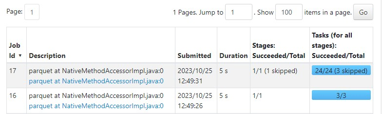

# BATCH PROCESSING
Batch processing is a method of running high-volume, repetitive data jobs. 
With batch processing, users collect and store data, and then process the data during an event known as a “batch window.”

# APACHE SPARK
Official apache spark website defines apache spark as a multi-language engine for executing data engineering, data science, and machine learning on single-node machines or clusters.

The Apache Spark framework uses a master-slave architecture that consists of a driver, which runs as a master node, and many executors that run across as worker nodes in the cluster. Apache Spark can be used for batch processing and real-time processing as well.


#### Spark driver
Resembles cockpit of spark applications.It controlles all spark applications and keeps track of application state.

#### cluster manager

cluster manager provides resources to all worker nodes as per need, it operates all nodes accordingly.

Cluster manager types:
1. **Standalone** – a simple cluster manager included with Spark that makes it easy to set up a cluster.
2. **Apache Mesos** – Mesons is a Cluster manager that can also run Hadoop MapReduce and Spark applications.
3. **Hadoop YARN** – the resource manager in Hadoop 2. This is mostly used, a cluster manager.
3.** Kubernetes** – an open-source system for automating deployment, scaling, and management of containerized applications.

#### spark executors
The core responsibility of a Spark executor is to take the assigned tasks, run them, and report back their success or failure state and results.


 ### Spark RDD
 At the heart of Apache Spark is the concept of the **Resilient Distributed Dataset (RDD)**, a programming abstraction that represents an **immutable** collection of objects that can be split across a computing cluster.


### Apache Spark Advantages
- Spark is a general-purpose, in-memory, fault-tolerant, distributed processing engine that allows you to process data efficiently in a distributed fashion.
- Applications running on Spark are 100x faster than traditional systems.
- You will get great benefits from using Spark for data ingestion pipelines.
Using Spark we can process data from Hadoop HDFS, AWS S3, Databricks DBFS, Azure Blob Storage, and many file systems.
- Spark natively has machine learning and graph libraries.
- Provides connectors to store the data in NoSQL databases like MongoDB.


## Partitions
-------
Spark/PySpark partitioning is a way to split the data into small multiple chunks so that you can execute transformations on multiple partitions in parallel which allows completing the job faster.

You can also write partitioned data into a file system (multiple sub-directories) for faster reads by downstream systems.

Let take a look at this image:


Pyspark creates a task for each partition and therefore if there is one big file it will only be assigned to one executor and the other work nodes remain idle.

However when we partition our data


Each partition get executed by an executor facilitating high parellelism. 

### is too many partitions good?
It may sound that the more the partitions the better the performance.However, Spark has to create one task per partition and most of the time goes into creating, scheduling, and managing the tasks then executing.

### What about few partitions?
- With too few partitions, you won't be able to take full advantage of the available cluster resources.
- **Slower Execution**: Fewer partitions mean that each task or operation has to process more data, which can slow down the execution of your Spark application. It may take longer to complete the same workload compared to having a larger number of partitions.

### Default spark partition
By default, Spark/PySpark creates partitions that are equal to the number of CPU cores in the machine.

In our case we are running on local standalone mode and therfore spark partitions data into the number of CPU cores I have in my system or the value that I will specify.

```py
spark = SparkSession.builder \
    .master("local[*]") \
    .appName('test') \
    .getOrCreate()
```
The above example provides local[*] as an argument to master() method meaning to run the job locally with partitions equal to number of the cores.

```py
print(df.rdd.getNumPartitions())
```
By default the number of partitions were 3.

`repartition()` method is used to increase or decrease the RDD/DataFrame partitions by number of partitions or by single column name or multiple column names.

```py
df2=df2.repartition(24)
```
The data or rows are distributed across 24 multiple partitions across many executors.

We then write the parquet file with the partitions in a new folder and each of the partitions is stored in a file with the suffix , which is `Parquet_snappy.parquet 's` default high-speed compression format .

Spark.write.parquet() will generate two stages: the first with 3 tasks that correspond to the 3 cores of my CPU and the second with the 24 tasks corresponding to the 24 partitions that I have specified.

```py
df2.write.parquet('fhvhv/2021/01/',mode='overwrite')
```
When we can access the spark UI via `http://localhost:4040` we can view the jobs created.
 


> [!important]
> The repartition re-distributes the data from all partitions into a specified number of partitions which leads to a full data shuffle which is a very expensive operation when you have billions or trillions of data
> 


## Actions and Transformations
------

:cinema:[Video](https://www.youtube.com/watch?v=ti3aC1m3rE8&list=PL3MmuxUbc_hJed7dXYoJw8DoCuVHhGEQb&index=46)

Spark has 2 kind of operations:
1. Transformations
2. Actions

#### Transformations
Create a new dataframe without immediately computing the results.THey are referred to as `lazy evaluations` as they do not get executed right away, and action trigger them to execute.
Examples:
- select()
- Filter()
- groupBy()
- Map()
- Join()
- repartition()

#### Action
PySpark actions trigger the computation of the DataFrame and return a value or perform a side effect on the data.Example:
- show()
- head()
- take(),takeOrdered(),takeSample()
- count()
- max,min,sum,variance

Example we want to select a list of columns where the diapatching_num is B02437
```py
# let get the data where the dispatching_base_num==B02437
df2.select('pickup_datetime','dropoff_datetime','PUlocationID',
          'DOlocationID') \
    .filter(df2.dispatching_base_num=='B02437')
```
Select( ) is a transformation that allows us to get the coluns that we want and filter( ) allows us to get only the data that meets the condition.If we execute the code a dataframe is just returned.
```
DataFrame[pickup_datetime: timestamp, dropoff_datetime: timestamp, PUlocationID: int, DOlocationID: int]
```
However when we use show() it triggers the execution of the transformations and returns the required data.
```py
# let get the data where the dispatching_base_num==B02437
df2.select('pickup_datetime','dropoff_datetime','PUlocationID',
          'DOlocationID') \
    .filter(df2.dispatching_base_num=='B02437') \
    .show()
```
Output:
```
+-------------------+-------------------+------------+------------+
|    pickup_datetime|   dropoff_datetime|PUlocationID|DOlocationID|
+-------------------+-------------------+------------+------------+
|2023-01-12 12:58:49|2023-01-12 13:15:16|        NULL|         182|
|2023-01-11 21:15:52|2023-01-11 21:34:58|        NULL|         127|
|2023-01-27 15:44:25|2023-01-27 15:53:09|        NULL|          69|
|2023-01-01 16:37:15|2023-01-01 16:54:45|        NULL|         168|
|2023-01-24 11:27:24|2023-01-24 11:47:33|        NULL|         212|
+-------------------+-------------------+------------+------------+
only showing top 5 rows
```
## Pyspark functions
---

Whe working with pyspark you can use:
1. built-in functions
2. user defined functions (UDF)

### Built in functions
PySpark SQL provides several built-in standard functions pyspark.sql.functions to work with DataFrame and SQL queries. All these PySpark SQL Functions return pyspark.sql.Column type.

In order to use these SQL Standard Functions, you need to import the below packing into your application

```py
From pyspark.sql import function as F
```
We use a built in function `F.to_date` that extracts the date from a datetime column.`with_column` is a transformation operation that creates a new column.
```py
df2 \
   .withColumn('pickup_date',F.to_date(df2.pickup_datetime)) \
   .withColumn('dropoff_date',F.to_date(df2.dropoff_datetime)) \
   .select('pickup_date','dropoff_date','PUlocationID','DOlocationID') \
   .show()
```
### User defined functions(UDF)

UDF are user custom pyhton functions similar to UDF on traditional databases.UDF’s are used to extend the functions of the framework and re-use these functions on multiple DataFrame’s.

Example we can create a python function that checks if ispatching_base_num numbers are even or odd.
```py
def divisibility(base_num):
    num=int(base_num[1:])
    if num % 2 ==0:
        return f'even/{num:03x}'
    else:
        return f'odd/{num:03x}'
```
We then have to convert this function `divisibility()` to UDF by passing the function to PySpark SQL udf(), this function is available at org.apache.spark.sql.functions.udf package.

```py
divisibility_udf=F.udf(divisibility,returnType=types.StringType())
```
Now let's use the UDF`divisibility_udf` with the dataframe using `with column` transformation.

```py
df2 \
   .withColumn('base_id',divisibility_udf(df2.dispatching_base_num)) \
   .select('base_id','pickup_datetime', 'dropoff_datetime', 'PULocationID', 'DOLocationID') \
   .show()

```

## DataFrames and Spark SQL
-------

Spark sql is a module in spark which integrated relational processing with spark's functional programming API.

In simple terms it is a module used to perform SQL-like operations on the data stored in memory.
Spark SQL allows you to query structured data using either SQL or DataFrame API.

### Spark sql dataframe API
Databriks defines a dataframe well
> DataFrame is a distributed collection of data organized into named columns. It is conceptually equivalent to a table in a relational database or a data frame in R/Python, but with richer optimizations under the hood. DataFrames can be constructed from a wide array of sources such as structured data files, tables in Hive, external databases, or existing RDDs

#### Prerequisite
:cinema:[Video](https://www.youtube.com/watch?v=CI3P4tAtru4&list=PL3MmuxUbc_hJed7dXYoJw8DoCuVHhGEQb&index=47)

Before we implement sql queries the dataset were are going to use are:
- Yellow_taxi data (2019 and 2020) [Yellow-taxi-data](https://github.com/DataTalksClub/nyc-tlc-data/releases/tag/yellow)
- Green taxi data (2019 and 2020)[Green- taxi-data](https://github.com/DataTalksClub/nyc-tlc-data/releases/tag/green)


The data was ontained from [NYC TLC website](https://www.nyc.gov/site/tlc/about/tlc-trip-record-data.page)

I have provides a bash script [data_download](download_data.sh) that dowloads the csv files and stores them locally.To avoid schema issues I have also I have created a notebook to define the data schema and convert the csv files to parquet.[shema_change](data_schema.ipynb)

-----------
So in this section we are going to create a dataframe first for both green and yellow taxi data, do some transformations and join them to get a unioned dataframe.  


:cinema:[Video](https://www.youtube.com/watch?v=uAlp2VuZZPY&list=PL3MmuxUbc_hJed7dXYoJw8DoCuVHhGEQb&index=48)

:memo:[Notebook](Code/02_spark_sql.ipynb)

```py
df_green=spark.read.parquet("C:/data_engineering_project/06_Batch_processing_with_spark/data/pq/green/*/*")
df_green.show()
```
```py
df_yellow=spark.read.parquet("C:/data_engineering_project/06_Batch_processing_with_spark/data/pq/yellow/*/*")
df_yellow.show()
```
When we display the data we notice that `df_green` dataframe has `lpep_pickup_datetime` and `lpep_dropoff_datetime` while `df_yellow` has `tpep_pickup_datetime` and `tpep_dropoff_datetime`.

```py
df_green=df_green \
           .withColumnRenamed('lpep_pickup_datetime','pickup_datetime') \
           .withColumnRenamed('lpep_dropoff_datetime','dropoff_datetime')
```
```py
df_yellow=df_yellow \
           .withColumnRenamed('tpep_pickup_datetime','pickup_datetime') \
           .withColumnRenamed('tpep_dropoff_datetime','dropoff_datetime')
```

To rename these columns we use `WithColumnRenamed()` 

Since DataFrame’s are an immutable collection, you can’t rename or update a column instead when using withColumnRenamed() it creates a new DataFrame with updated column names


The two data frames have disparities in some columns therefore we are going to get the common columns
```py
common_columns=[]

yellow_columns=set(df_yellow.columns)
for col in df_green.columns:
    if col in yellow_columns:
        common_columns.append(

```

Let create new columns in each dataframe and select the common columns.

```py
df_green_sel=df_green \
             .select(common_columns) \
             .withColumn('service_type',F.lit('green'))
```
```py
df_yellow_sel=df_yellow \
             .select(common_columns) \
             .withColumn('service_type',F.lit('yellow'))
```
- `Lit()` is a pyspark sql function used to ass a new column to the dataframe by assigning a constant value.
In our case we created a `service_type` column that contains **'green'** or **'yellow'** values.

Merging the dataframes
```python
df_trips=df_green_sel.union(df_yellow_sel)

```
- `union()`merge two or more DataFrame’s of the same schema or structure.


#### Coverting DataFrame to an sql table
```py
df_trips.createOrReplaceTempView('Trips_data')
``` 
- `createOrReplaceTempView()` is a method in Apache Spark’s DataFrame API that allows you to register a DataFrame as a temporary table in the Spark SQL catalog so that you can run SQL queries.
- `Trips_data` is the name of the temporary table created.The name is a string and should not contain spaces.
- When you register a DataFrame as a temporary table using createOrReplaceTempTable() method, it is only available for the lifetime of the SparkSession in which it is registered. Once the session is terminated, the temporary table is automatically removed from the Spark SQL catalog.
- The registered temporary table can be queried using Spark SQL from any part of the Spark application that has access to the SparkSession. The temporary table is visible to all the Spark SQL queries executed within the same SparkSession.

Let perform some queries now 
```py
spark.sql ("""
SELECT service_type,count(service_type) AS Count 
FROM Trips_data
GROUP BY service_type
""").show()
```
```py
df_result = spark.sql("""
SELECT 
    -- Reveneue grouping 
    PULocationID AS revenue_zone,
    date_trunc('month', pickup_datetime) AS revenue_month, 
    service_type, 

    -- Revenue calculation 
    SUM(fare_amount) AS revenue_monthly_fare,
    SUM(extra) AS revenue_monthly_extra,
    SUM(mta_tax) AS revenue_monthly_mta_tax,
    SUM(tip_amount) AS revenue_monthly_tip_amount,
    SUM(tolls_amount) AS revenue_monthly_tolls_amount,
    SUM(improvement_surcharge) AS revenue_monthly_improvement_surcharge,
    SUM(total_amount) AS revenue_monthly_total_amount,
    SUM(congestion_surcharge) AS revenue_monthly_congestion_surcharge,

    -- Additional calculations
    AVG(passenger_count) AS avg_montly_passenger_count,
    AVG(trip_distance) AS avg_montly_trip_distance
FROM
    Trips_data
GROUP BY
    1, 2, 3
""")
```
View the output
```
df_result.show()
```
Save the data
```py
df_result.coalesce(1).write.mode('overwrite').parquet('C:/data_engineering_project/06_Batch_processing_with_spark/data/report/revenue')
```
`coalesce()`  is useed to only decrease the number of partitions.The movement of the data across the partitions is lower using coalesce.

## GROUP BY AND JOINS
---------
:cinema:[Video](https://www.youtube.com/watch?v=9qrDsY_2COo&list=PL3MmuxUbc_hJed7dXYoJw8DoCuVHhGEQb&index=50)

:memo: [Notebook](./Code/03_groupby_and_joins.ipynb)

Let use sql queries to get the total amount paid per hour and per zone.

```py
df_green=spark.read.parquet('C:/data_engineering_project/06_Batch_processing_with_spark/data/pq/green/*/*')

df_green.createOrReplaceTempView('green')
```
```py
df_green_revenue=spark.sql("""
SELECT
    date_trunc('hour', lpep_pickup_datetime) AS hour, 
    PULocationID AS zone,

    SUM(total_amount) AS green_amount,
    COUNT(1) AS green_number_records
FROM
    green
WHERE
    lpep_pickup_datetime >= '2020-01-01 00:00:00'
GROUP BY
    1,2
""")
```
The output is a follows after you run `df_green_revenue.show()`:
```
+-------------------+----+------------------+--------------------+
|               hour|zone|      green_amount|green_number_records|
+-------------------+----+------------------+--------------------+
|2020-01-03 09:00:00| 226|108.33999999999999|                   6|
|2020-01-02 14:00:00|  26| 327.4800000000001|                  11|
|2020-01-06 15:00:00| 241|             184.7|                   3|
|2020-01-22 13:00:00|  74| 666.2399999999999|                  44|
|2020-01-14 23:00:00| 223|             48.31|                   4|
|2020-01-09 23:00:00| 260|202.33000000000004|                  16|
|2020-01-30 09:00:00|  75|1010.3499999999995|                  67|
|2020-01-11 21:00:00|  41| 700.5999999999997|                  50|
|2020-01-07 18:00:00|  45|112.39000000000001|                   4|
|2020-01-02 09:00:00|  42| 555.7500000000001|                  33|
|2020-01-04 23:00:00|  25|             376.4|                  26|
|2020-01-25 11:00:00| 259|            161.21|                   3|
|2020-01-16 20:00:00|  52|             108.6|                   7|
|2020-01-16 06:00:00|  74| 600.7999999999998|                  37|
|2020-01-17 07:00:00|  41| 481.6400000000002|                  39|
|2020-01-17 04:00:00|  82|108.74999999999999|                  10|
|2020-01-22 16:00:00| 244|            926.17|                  32|
|2020-01-02 18:00:00|  66|210.76000000000002|                  11|
|2020-01-30 22:00:00|  36|              85.1|                   3|
|2020-01-17 19:00:00|  17|133.57999999999998|                  13|
+-------------------+----+------------------+--------------------+
only showing top 20 rows
```

As a distributed processing framework, Spark partitions the data and distributes it to individual executors for parallel processing. To consolidate the outcomes from these executors, a critical operation called "shuffle" is executed.

When we inspect the Spark UI, we observe that the task is broken down into two distinct stages. The first stage involves preparing the groupBy operation, which generates intermediate groupings on each executor. The second stage is responsible for producing the final result by combining these intermediate results (shuffle).

To optimize processing, the first job caches the intermediate results, which are later utilized during the shuffle phase in the second job. This is why, in the second job, the first stage is marked as "Skipped" because it has already been completed in the first job.

When we examine each of the stages in depth, we can see that in the first stage, the data is partitioned into segments, and each segment is dispatched to an executor. On each executor, specific operations like filtering and grouping, typically performed using filter and groupBy operations, are carried out. These operations produce intermediate groupings or results.


In the second stage, the pivotal "shuffle" operation comes into play. Its primary purpose is to amalgamate all the intermediate results and group together the data that shares the same key within the same partition. In our example, the key is determined by the columns specified in the groupBy operation, which are 'hour' and 'zone'.

To elaborate further, during the shuffle process, data with matching keys are brought together and grouped within the same partition. It's worth noting that during the shuffle operation, it's possible that some partitions may contain data associated with different keys. However, in the final grouping operation that follows, the data is meticulously organized and redistributed to the respective partitions based on their associated keys. This ensures that each partition contains data that shares a common key, facilitating further data processing and analysis.


#### Joins

:cinema:[Video](https://www.youtube.com/watch?v=lu7TrqAWuH4&list=PL3MmuxUbc_hJed7dXYoJw8DoCuVHhGEQb&index=51)

Spark DataFrame supports all basic SQL Join Types like INNER, LEFT OUTER, RIGHT OUTER, LEFT ANTI, LEFT SEMI, CROSS, SELF JOIN. Spark SQL Joins are wider transformations that result in data shuffling over the network hence they have huge performance issues when not designed with care.

We will perform an `outer join` where the join returns all rows from yellow and green dataframes and where join expression doesn't match it returns nulls on respective columns.

```py
df_join=df_green_revenue.join(df_yellow_revenue,on=['hour','zone'],how='outer')
df_join.show()
```
- `df`: The DataFrame to join with the parent DataFrame . It must be specified as a Pyspark DataFrame object.
- `on` : specify one or more columns common to both Dataframes.
- `how`:defines the type of join that will be made either inner,right_outer,full_outer,left_outer.

#### Broadcasting
In broadcasting, the smaller dataset is replicated and sent to all worker nodes, making it readily available for join operations without the need for shuffling or transferring large amounts of data across the network. This significantly improves the performance and efficiency of join operations, especially when one dataset is much smaller than the other. Broadcasting is commonly used when one of the datasets can fit in memory and the other is too large to be broadcasted efficiently.

Let get a taxi_zone data and join with the `df_join` data and attach the name of the zone.


- The zone data is broadcasted across the 3 executors.

```py
!wget https://s3.amazonaws.com/nyc-tlc/misc/taxi+_zone_lookup.csv

df=spark.read \
    .option('header','True') \
    .csv('./taxi+_zone_lookup.csv')

df.write.parquet('zones')
df_zones= spark.read.parquet('zones/')

df_result = df_join.join(df_zones, df_join.zone == df_zones.LocationID)

df_result.drop('LocationID', 'zone').write.parquet('C:/data_engineering_project/06_Batch_processing_with_spark/data/report/revenue/revenue-zones')

```

---

## Running spark in the cloud
---------


:cinema:[Video](https://www.youtube.com/watch?v=Yyz293hBVcQ&list=PL3MmuxUbc_hJed7dXYoJw8DoCuVHhGEQb&index=54)

So far we have been running spark locally using the data locally stored in our machines.Now we ae going to load the data to the google cloud and run spark in the cloud.

First let upload the locally stored data to a bucked in google cloud storage.

```
gsutil -m cp -r pq gs://de_data_lake_data-engineering-398114/pq
```
- `gsutil cp` allows one to copy data betwrrn local file system and cloud.

- `-m` perform a multiprocess copy especilly if you have large files.

- `-r` used to copy an entire directory or recursively.

#### configuring spark with GCS connector
The Cloud Storage connector is an open source Java library that lets you run Apache Hadoop or Apache Spark jobs directly on data in Cloud Storage.

Let's download the jar file and save it in a folder named `/lib` the working directory.
```
gsutil cp gs://hadoop-lib/gcs/gcs-connector-hadoop3-latest.jar gcs-connector-hadoop3-latest.jar
```

>[important]
> Copy the downloaded jar file in the jar folder where spark was installed.In my case I pasted the file here `C:/tools\Spark\spark-3.5.0-bin-hadoop3\jars`

For us to read the remote data we need to create a jupyter [04_spark_sql_gcs](code/04_spark_sql_gcs.ipynb)notebook and configure some configurations.

```py
from pyspark.sql import SparkSession

spark = SparkSession.builder \
        .master("local[*]") \
        .appName('test') \
        .getOrCreate()

spark._jsc.hadoopConfiguration().set("google.cloud.auth.service.account.json.keyfile", "C:/Users/user/Documents/de_datatalk/data-engineering-398114-66b775023dd6.json")

df_green=spark.read.parquet('gs://de_data_lake_data-engineering-398114/pq/green/*/*')
```
- we create a spark session and define the master as local instructing it to use all the available cores.
- You need to provide the path to the json file for the service your service account.(If you don't have a service account create one and generate the key).
- With this we are able to read the data in the google cloud storage.
- :warning:
  If you encounter `py4JJavaError` error which suggests that there might be an issue with the configuration or availability of a specific JAR file in the context of Spark:
  1. Make sure you have pasted the jar file in the jar folder where spark was installed.
  2. If you're working with Hadoop-related configurations in your Spark application, make sure that you have provided the necessary JAR files in the Hadoop Configuration.

### Local cluster and spark-submit
:cinema:[Video](https://www.youtube.com/watch?v=HXBwSlXo5IA&list=PL3MmuxUbc_hJed7dXYoJw8DoCuVHhGEQb&index=55)

#### Standalone cluster
Apache `Spark Standalone` is one of the cluster manager options for running Apache Spark, a popular open-source, distributed data processing framework. Spark Standalone is a built-in cluster manager that comes bundled with Spark. It allows you to set up and manage a Spark cluster without relying on external cluster management tools like Apache Hadoop YARN or Apache Mesos. Spark Standalone provides a simple and easy-to-use way to get started with Spark clusters, especially for smaller or testing environments.


- `Master and workers`:The master is responsible for managing the cluster and distributing work to the work nodes.
- `Master URL`: When you submit a Spark application to a Spark Standalone cluster, you specify the master URL to connect to the cluster. The master URL typically looks like `spark://<master-node-host>:<port>`.

Let's start the standaone cluster by launching the script provided by spark(sbin folder).

Open a terminal of your choice and navigate to `C:\tools\Spark\spark-3.5.0-bin-hadoop3\sbin` then paste the following command

```
spark-class org.apache.spark.deploy.master.Master
```

Output:

- You can access the UI from `http://localhost:8080`


Starting a worker, cd to `C:\tools\Spark\spark-3.5.0-bin-hadoop3\sbin` and paste the following.
```
spark-class org.apache.spark.deploy.worker.Worker spark://172.24.160.1:7077
```
Where `spark://172.24.160.1:7077` is the master url.

Output:


So far we have not given any jobs therefore let's modify the a notebook and run the code. You can get the complete notebook here:point_right:[05_spark_cluster](Code/05_spark_cluster.ipynb)

```py
spark = SparkSession.builder \
    .master("spark://172.24.160.1:7077") \
    .appName('test') \
    .getOrCreate()
```
- Here the master is not local but the remote standalone cluster with the master node located at the IP address 172.24.160.1 and listening on port 7077. 


:smiley: wow now our cluster is configured.Let convert one of the notebooks into a python script and parameterize it

#### Parameterizing the python script
We don't want to hard code data location path but pass them as arguments in the command line.
`argpaese` is the standard pyhton library for passing command line arguments.
```py
import argparse

import pyspark
from pyspark.sql import SparkSession
from pyspark.sql import functions as F


parser = argparse.ArgumentParser()

parser.add_argument('--input_green', required=True)
parser.add_argument('--input_yellow', required=True)
parser.add_argument('--output', required=True)

args = parser.parse_args()

input_green = args.input_green
input_yellow = args.input_yellow
output = args.output


spark = SparkSession.builder \
    .appName('test') \
    .getOrCreate()


df_green=spark.read.parquet(input_green)
df_yellow=spark.read.parquet(input_yellow)

## ---code continues

df_result.coalesce(1) \
    .write.parquet(output, mode='overwrite')
```
Check out the complete code here:point_right:[spark_cluster](code/spark_cluster.py)

Lets run the script now in the command line:
```bash
python code/spark_cluster.py \
    --input_green "C:/data_engineering_project/07_Batch_processing_with_spark/data/pq/green/2020/*/" \
    --input_yellow "C:/data_engineering_project/07_Batch_processing_with_spark/data/pq/yellow/2020/*/" \
    --output "C:/data_engineering_project/07_Batch_processing_with_spark/data/report/revenue/revenue-2019"

```
Access the web UI and check that a worker has been assigned a job.

#### Spark submit
The `spark-submit` command is a utility to run or submit a Spark or PySpark application program (or job) to the cluster by specifying options and configurations.


```bash
spark-submit \
   --master="spark://172.24.160.1:7077" \
   code/spark_cluster.py \
    --input_green "C:/data_engineering_project/07_Batch_processing_with_spark/data/pq/green/2019/*/" \
    --input_yellow "C:/data_engineering_project/07_Batch_processing_with_spark/data/pq/yellow/2019/*/" \
    --output "C:/data_engineering_project/07_Batch_processing_with_spark/data/report/revenue/revenue-2019"

```
- `--master="spark://172.24.160.1:7077"`: we specify the sddress of the spark master node to which spark jobs should connect..
- `code/spark_cluster.py`: specifies the pyhton script that contains spark jobe code.
- We then provide path to the locally stored data and the path to store the output.

### Setup a Dataproc Cluster

:cinema: [Video](https://www.youtube.com/watch?v=osAiAYahvh8&list=PL3MmuxUbc_hJed7dXYoJw8DoCuVHhGEQb&index=56)

Dataproc is a managed Spark and Hadoop service that lets you take advantage of open source data tools for batch processing, querying, streaming, and machine learning. 

Dataproc automation helps you create clusters quickly, manage them easily, and save money by turning clusters off when you don't need them.

- Go to your google clod platform and search for Dataproc.(You may be required to enable the AP1)
- Click on set up cluster and choose `cluster on Computer Engine`
- Cluster name:`de_talk_cluster`
- region:`europe-west6`. **NB**: **The region chosen should be where the bucket is located**.
- Cluster type:`single node` is ideal for testing.It consists of one node and is cheaper.
- Optionally, you may install additional components but we won't be covering them in this lesson.
- You can leave all other configurations as they are.
- click on save custer
     

    


There are 3 ways in which we can submit a job in dataproc:
1. Using the web UI
2. Using gcloud SDK
3. API

### Running spark job from Web UI
Once you have created a cluster on the top click on `submit job` and fill in the details.
- Upload the python script we created earlier to gcs and paste the path
- Job type:`pyspark`
- Add the path to the location where the data is located in google cloud storage and paste the path in the argument section.
- Click submit


When successful it should have created an output at the specified folder in GCS.


### Running spark job from Web UI

```bash
gcloud dataproc jobs submit pyspark ^
--cluster=datatalk-de-project-cluster ^
--region=europe-west6 ^
gs://de_data_lake_data-engineering-398114/pq/code/spark_cluster.py ^
-- ^
--input_green=gs://de_data_lake_data-engineering-398114/pq/green/2020/* ^
--input_yellow=gs://de_data_lake_data-engineering-398114/pq/yellow/2020/* ^
--output=gs://de_data_lake_data-engineering-398114/pq/report-2020

```
Output:


### Dataproc and Bigquery
:cinema:[Video](https://www.youtube.com/watch?v=HIm2BOj8C0Q&list=PL3MmuxUbc_hJed7dXYoJw8DoCuVHhGEQb&index=57)

Through out when we were submitting jobs in dataproc cluster the output was eing stored back to GCS.

Now we want to load the the output in BigQuery table.

Let's create another python script [spark_cluster_to_bigquery](code/spark_cluster_to_bigquery.py) and modify the folllowing:
```py
spark = SparkSession.builder \
    .appName('test') \
    .getOrCreate()

spark.conf.set('temporaryGcsBucket', 'dataproc-temp-europe-west6-265267271198-pti7v6nd')

```
When we created a cluster temporary buckets were created in GCS copy the name of the buckets and paste it there.


For the output write to bigquery
```py
df_result.write.format('bigquery') \
    .option('table',output) \
    .save()

```
Save and upload the script to gcs.

Submit a spark using gcloud sdk

```py
gcloud dataproc jobs submit pyspark ^
--cluster=datatalk-de-project-cluster ^
--region=europe-west6 ^
gs://de_data_lake_data-engineering-398114/pq/code/spark_cluster_to_bigquery.py ^
-- ^
--input_green=gs://de_data_lake_data-engineering-398114/pq/green/2020/* ^
--input_yellow=gs://de_data_lake_data-engineering-398114/pq/yellow/2020/* ^
--output=ny_taxi_data.reports-2020
```
- The output specifies the dataset `ny_taxi_data` created in bigquery( if you don't have a dataset create one).
  
Output

