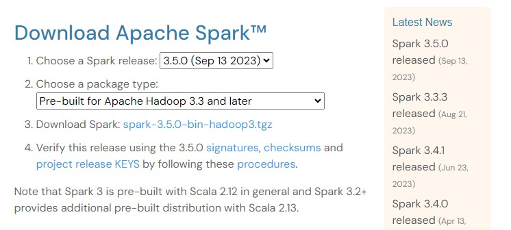

# Windows
---
This is a guide on how to install and setup  spark on windows 10 and windows 11.

THe command line used fpr this turotial is [GItbash](https://gitforwindows.org/)

## Step 1 : installing Java
You need to install java 11, you can dowload it from :point_right:https://www.oracle.com/ke/java/technologies/javase/jdk11-archive-downloads.html.  You may be required to create an oracle account.

Download **Windows x64 compressed ARchive**

At the making of this tutorial I used jdk-11-0-20 windows x64 Compressed Archive.

Create a folder in your C drive with no space in the path e.g `C:/tools` and unzip the dowloaded file.THe complete path can `C:\tools\Java\jdk-11.0.20` 

#### Configuring path
- Right-click on "This PC" or "My Computer" and select "Properties."
- Click on "Advanced system settings" on the left.
- In the "System Properties" window, click the "Environment Variables" button.
In the "Environment Variables" window, under "**User variables**"

   Variable name `JAVA_HOME`

   Variable value : `C:\tools\Java\jdk-11.0.20`

- Under Sytem variables click on Path NEW the add this `%JAVA_HOME%\bin` click okay and save.

Check that java is working correctly, on the gitbash terminal type:
```
java --version
```
Output:
```
java 11.0.20 2023-07-18 LTS
Java(TM) SE Runtime Environment 18.9 (build 11.0.20+9-LTS-256)
Java HotSpot(TM) 64-Bit Server VM 18.9 (build 11.0.20+9-LTS-256, mixed mode)
```
:warning:
If you run `java --version ` and don't get a response and you have configured the path well,check the system path if it contains the following:
```
c:\Program Files\Common Files\Oracle\Java\javapath
c:\Program Files\Java\jdk-14.0.2\bin
```
Delete `c:\Program Files\Common Files\Oracle\Java\javapath` from the path, close and reopen the terminal.


## Step 2 : intsalling hadoop
Create a another folder in the and name it hadoop e.g `c:/tools/hadoop`.

We'll need Hadoop 3.2 which we'll get from [here](https://github.com/cdarlint/winutils/tree/master).You can choose any 3.0 and above version.

From your gitbash navigate to the hadoop folder `c:/tools/hadoop`and paste the following
```bash
HADOOP_VERSION="3.2.0"
PREFIX="https://raw.githubusercontent.com/cdarlint/winutils/master/hadoop-${HADOOP_VERSION}/bin/"

FILES="hadoop.dll hadoop.exp hadoop.lib hadoop.pdb libwinutils.lib winutils.exe winutils.pdb"

for FILE in ${FILES}; do
  wget "${PREFIX}/${FILE}"
done
```
> Note : you can change the version that you want e.g `HADOOP_VERSION="3.3.5"`

A umber of files listed above will be dowloaded to the hadoop folder.Create a folder in hadoop and name it bin `c:/tools/hadoop/bin` then cut and paste the files to be inside the bin folder.

#### Configuring the path
-  Right-click on "This PC" or "My Computer" and select "Properties."
- Click on "Advanced system settings" on the left.
- In the "System Properties" window, click the "Environment Variables" button.
In the "Environment Variables" window, under "**User variables**"

   Variable name `HADOOP_HOME`

   Variable value : `C:\tools\hadoop`

- Under Sytem variables click on Path NEW the add this `%HADOOP_HOME%\bin` click okay and save.

## Step 3: Installing spark

Dowload spark from this site [Apache spark](https://spark.apache.org/downloads.html)



> [!IMPORTANT]
> choose a package type with the hadoop version you dowloaded.e.g You can't choose `pre-built for Apache Hadoop 3.3 and later` and then use hadoop wunutils  hadoop version 2. 


Click on Download spark

Create a new folder and name it spark `c:\tools\spark`

Unzip the file in the spark folder.

#### Configuring path
-  Right-click on "This PC" or "My Computer" and select "Properties."
- Click on "Advanced system settings" on the left.
- In the "System Properties" window, click the "Environment Variables" button.
In the "Environment Variables" window, under "**User variables**"

   Variable name `SPARK_HOME`

   Variable value : `C:\tools\spark\spark-3.5.0-bin-hadoop3`

- Under Sytem variables click on Path NEW the add this `%SPARK_HOME%\bin` click okay and save.

And that all.

### Testing
Cd into `spark-3.3.2-bin-hadoop3` and run the following;
```
./bin/spark-shell.cmd
```
At this point you may get a message from windows firewall — allow it.

Output
```
Setting default log level to "WARN".
To adjust logging level use sc.setLogLevel(newLevel). For SparkR, use setLogLevel(newLevel).
23/10/24 10:58:51 WARN Utils: Service 'SparkUI' could not bind on port 4040. Attempting port 4041.
Spark context Web UI available at http://DESKTOP-SUKRL75.mshome.net:4041
Spark context available as 'sc' (master = local[*], app id = local-1698134331490).
Spark session available as 'spark'.
Welcome to
      ____              __
     / __/__  ___ _____/ /__
    _\ \/ _ \/ _ `/ __/  '_/
   /___/ .__/\_,_/_/ /_/\_\   version 3.5.0
      /_/

Using Scala version 2.12.18 (Java HotSpot(TM) 64-Bit Server VM, Java 11.0.20)
Type in expressions to have them evaluated.
Type :help for more information.

scala>
```